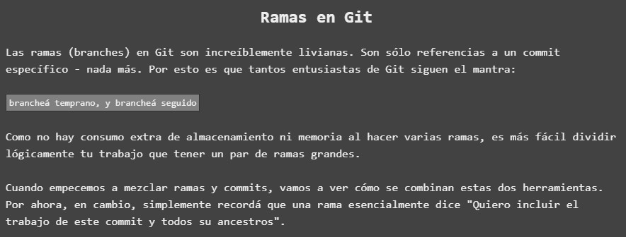
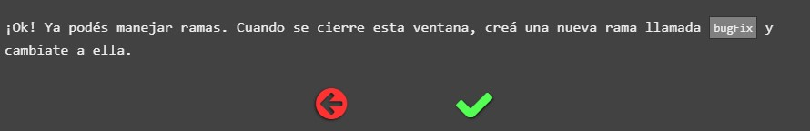
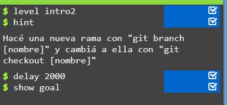

Como se nos indica en el enunciado, en este segundo ejercicio introductorio trabajaremos con las ramas en Git. Como podemos ver, éste nos ofrece una pequeña introduccion conceptual a lo que es una "rama en Git"

# Comenzando Ejercicio

En este ejercicio deberemos realizar la siguiente tarea asiganada:

Una vez situado en el editor, se nos muestra por consola el siguiente código:

**Encontrándonos en esta parte del diagrama**

